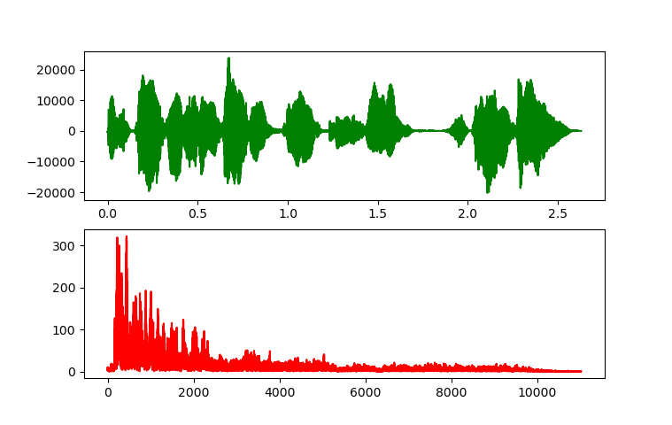
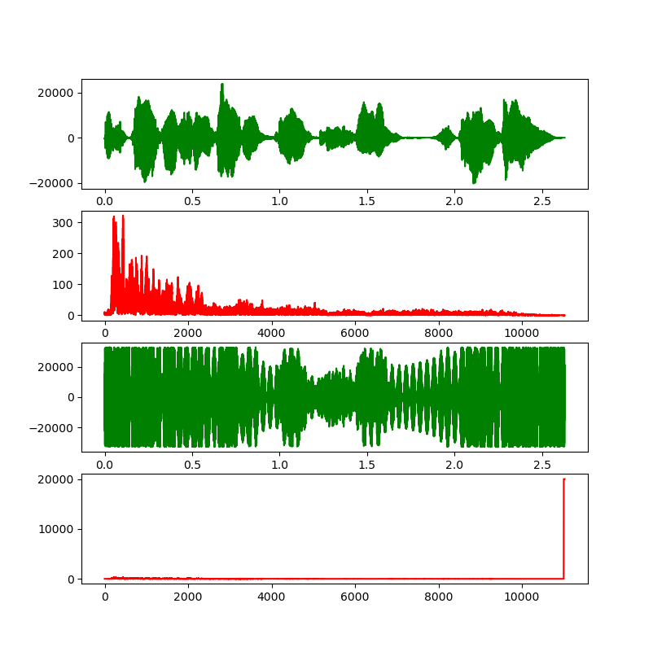
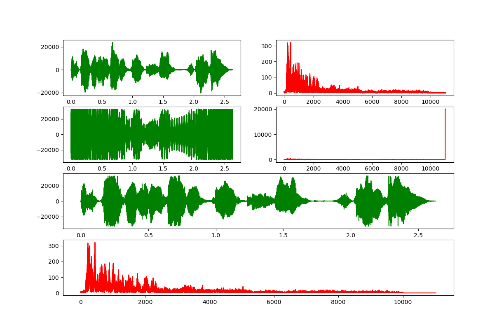

# Python 实现音频频域处理

## 音频文件
- 这里选择的是wav格式，因为wav格式没有经过压缩，方便处理。
- 为了方便咱选择了一个单声道的wav文件进行操作。
- 采样率随意
  
## 时域与频域
- 通过numpy库的FFT将时域信号转成频域信号。
- 分别在时域与频域观察音频
    
    可以发现频域信息（红色) 主要集中在10000以前。

- 原文件为[eva.wav](eva.wav) （来自《Command and Conquer：Red Alert II》 声音曾经过处理）

## 噪声
- 在频域信号上加入噪声。
- 为了不影响原始声音信息，这里将噪声加在11000以后，模拟高频噪声。
- 
    将频域信号转回时域，可以发现我们已经几乎看不出原信号的波形（绿色下）了。

- 加入噪声后的文件为[evan.wav](evan.wav)

## 滤波
- 在频域上将10000以后的信号强度归零
     
    下方两行是滤波后的波形，可以看出高频噪声已经被铲除，将频域信号逆变换成时域信号，就可以输出了。
    
    由于原信号在高频部分还是有信息的，这里将其与噪声一并滤除后使原信号产生了一定程度的失真，

- 滤波后文件为[evaf.wav](evaf.wav)